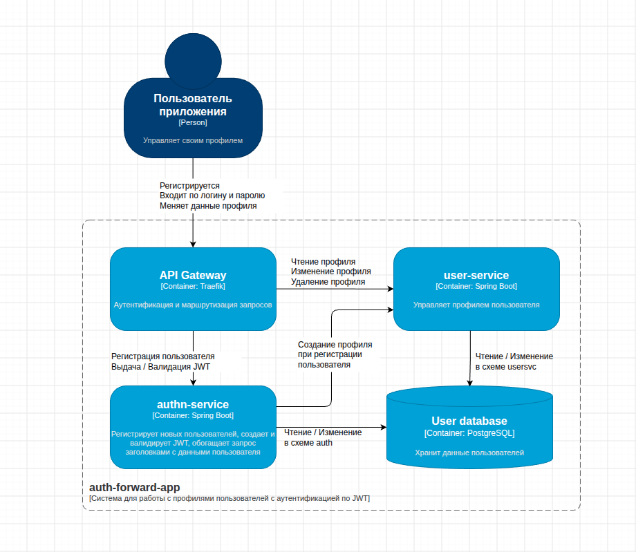
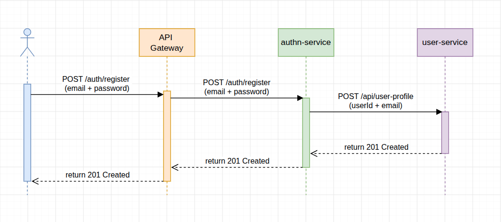
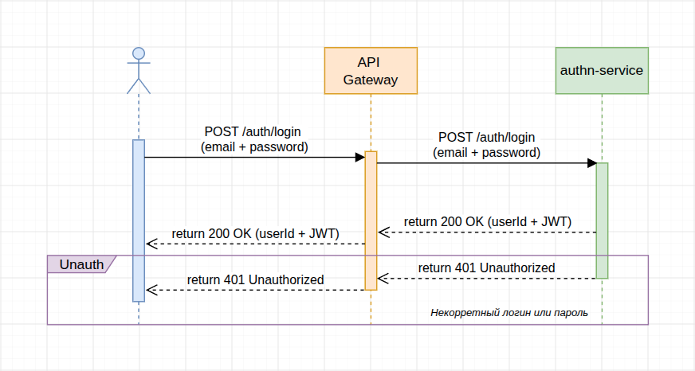
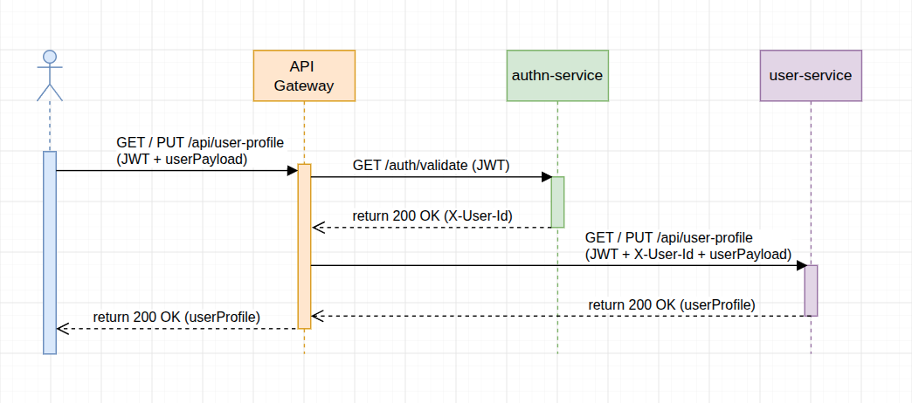
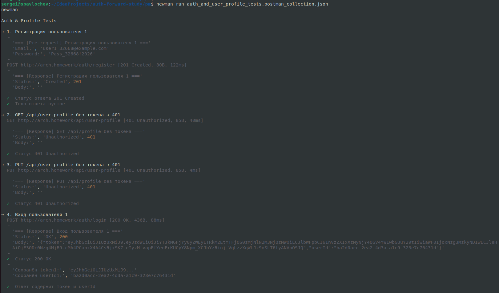
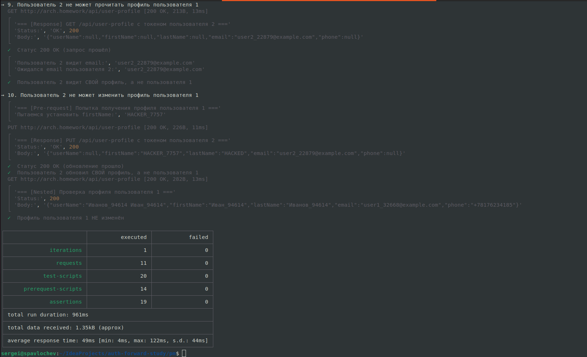

# API Gateway с forward аутентификацией

## Описание

### Информация о системе  
`user-svc` - приложение для работы с профилем пользователя, написанное на Spring Boot. Выставляет следующие endpoint-ы:
* `GET /api/user-profile` - получить профиль пользователя
* `PUT /api/user-profile` - обновить профиль пользователя
* `POST /api/user-profile` - создать профиль пользователя
* `DELETE /api/user-profile` - удалить профиль пользователя

Какой конкретно профиль нужно взять определяется на основе заголовка `X-User-Id`, который
передает система аутентификации.

Создание профиля пользователя происходит в момент регистрации - пользователь регистрируется в системе и 
в случае успеха сервис `authn-service` вызывает в синхроне через REST (http + json) метод `POST /api/profile` 
для создания профиля, в котором заполняются два поля - идентификатор пользователя и его email. Остальные данные 
пользователь вносит сам. В идеале должно быть событие UserCreated, которое бы слушал `user-svc` и самостоятельно
инициализировал профиль, но в рамках текущего проекта это не сделано для упрощения.

`authn-service` приложение для аутентификации, написанное на Spring Boot.
Выставляет следующие endpoint-ы::
* `POST /auth/register` - зарегистрировать пользователя в системе по его email и паролю
* `POST /auth/login` - вход в приложение, возвращает идентификатор пользователя и его JWT с TTL 24 часа.
* `GET /auth/validate` - проверка валидности JWT, возвращает статус 200 ОК и заголовок `X-User-Id`
с идентификатором пользователя если JWT валидный.

В качестве `API Gateway` используется Traefik. 

Для хранения данных используется СУБД PostgreSQL. База данных единая, но разделена на 2 схемы - `auth` и `usersvc` 
(только лишь для простоты запуска примера, в реальных системах будет использоваться две разные БД).
В каждой схеме есть своя таблица для хранения пользователей. В схеме auth таблица хранит учетные данные пользователя - 
его email и закодированный пароль. В схеме usersvc хранятся бизнес-данные пользователя - его инициалы, имя, фамилия, 
телефон и т.д., а также ссылка на идентификатор пользователя из таблицы схемы auth.

### Диаграммы последовательности

1. Регистрация нового пользователя \

2. Вход пользователя в систему \

3. Получение / изменение профиля пользователя \

## Развертывание в K8s

### Подготовка
1. Должен быть установлен и запущен minikube
2. Необходимо в отдельной сессии запустить: `minikube tunnel`
3. В терминале перейти в директорию `auth-forward-study/k8s`
4. Создать неймспейс `usersvc` командой: `kubectl create namespace usersvc`

### Развёртывание PostgreSQL и инициализация базы данных
`kubectl apply -f db-secrets.yaml` \
`helm install user-db oci://registry-1.docker.io/bitnamicharts/postgresql --namespace usersvc -f db-values.yaml` \
`kubectl apply -f db-init-configmap.yaml -f db-init-job.yaml`

### Установка Traefik
`helm repo add traefik https://traefik.github.io/charts` \
`helm repo update` \
`helm install traefik traefik/traefik --namespace usersvc`

### Развёртывание сервиса аутентификации
`kubectl apply -f authn-configmap.yaml \` \
`-f authn-secrets.yaml \` \
`-f authn-deployment.yaml \` \
`-f authn-service.yaml`

### Развёртывание сервиса пользователя
`kubectl apply -f user-svc-configmap.yaml \` \
`-f user-svc-deployment.yaml \` \
`-f user-svc-service.yaml`

### Развёртывание Traefik (ingress-controller + router)
`kubectl apply -f traefik-middleware.yaml \` \
`-f traefik-router.yaml`

## Тестирование

Тесты расположены здесь: [тесты](pm/auth_and_user_profile_tests.postman_collection.json)

Для запуска тестов перейти в директорию `pm` и использовать утилиту `newman`. Команда для прогона всех тестов: \
`newman run auth_and_user_profile_tests.postman_collection.json`

Так как используется имя хоста `arch.homework`, то предварительно нужно в файл `/etc/hosts` добавить строку маппинга
для внешнего IP traefik.

